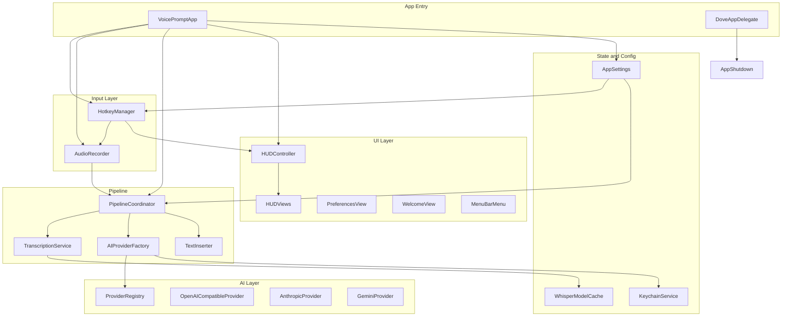
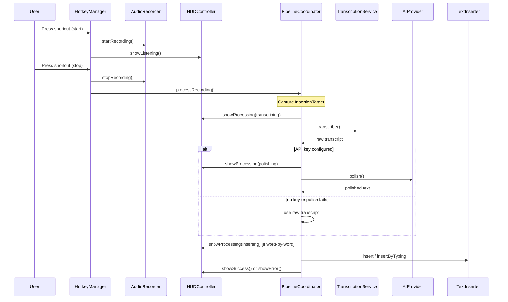

# Dove App Architecture

Master reference for the macOS app source in `[app/](../app/)`. This document explains what Dove does, how data flows through the system, and what every file and component is responsible for.

For a user-facing summary, see [README.md](../README.md).

---

## Table of contents

1. [Product overview](#product-overview)
2. [High-level architecture](#high-level-architecture)
3. [Directory map](#directory-map)
4. [Core user flows](#core-user-flows)
5. [Per-file reference](#per-file-reference)
6. [Non-Swift assets](#non-swift-assets)
7. [Cross-cutting concerns](#cross-cutting-concerns)
8. [Related documentation](#related-documentation)

---


## Product overview

**Dove** is a free, open-source macOS menu bar app. The user presses a global shortcut once to start recording, speaks naturally, presses again to stop. Dove then:

1. Transcribes audio **locally** with WhisperKit (works offline after the first model download)
2. Optionally **polishes** the transcript with a cloud AI provider (11 supported)
3. **Inserts** the result at the cursor in whatever app was focused when recording stopped

Key design principles:

- **Local-first speech** — Whisper runs on-device; no audio leaves the Mac for transcription
- **Bring your own API key** — Keys stored in macOS Keychain, never in UserDefaults or logs
- **No accounts, no analytics, no cloud history** — Settings and diagnostics stay on the Mac
- **Graceful fallbacks** — No API key → raw transcript; polish fails → raw transcript; insertion fails → clipboard
- **Menu bar only** — `LSUIElement` hides the Dock icon; Dove lives in the status bar

Requirements: macOS 14 (Sonoma)+, Apple Silicon recommended. Bundle ID: `com.mandeep.Dove`.

---


## High-level architecture




### Bootstrap sequence

Launch begins when the menu bar icon appears. Because `MenuBarExtra` content is lazy, `bootstrap()` runs from the label's `onAppear` — the only view rendered at launch:

```85:104:app/VoicePromptApp.swift
    private func bootstrap() {
        guard !didBootstrap else { return }
        didBootstrap = true

        let showWelcome = settings.shouldShowWelcomeOnLaunch
        DiagnosticLog.beginSession()
        registerShutdown()
        RecordingCleanup.cleanupStaleRecordings()
        LaunchAtLoginService.sync(enabled: settings.launchAtLogin)
        hudController.install(audioRecorder: audioRecorder, settings: settings)
        configurePipeline()
        // The welcome window walks through permissions, so skip the bare system prompt.
        hotkeyManager.refreshPermissionsAndStart(prompt: !showWelcome)
        // Warm-ups stay off the launch path so the menu bar responds immediately.
        Task { await audioRecorder.prepareIfNeeded() }
        Task { await transcriptionService.prepareModelIfNeeded(settings: settings) }
        if showWelcome {
            WelcomeWindow.present(using: openWindow)
        }
    }
```

Order of operations:

1. Start diagnostic session
2. Register graceful shutdown handler
3. Delete stale temp recordings from prior crashes
4. Sync launch-at-login with system
5. Create HUD floating panel
6. Wire hotkey callbacks to audio recorder and pipeline
7. Request Accessibility and install CGEvent tap
8. Warm up microphone and Whisper model in background
9. Optionally show welcome window


### SwiftUI scenes


| Scene                       | Purpose                                          |
| --------------------------- | ------------------------------------------------ |
| `MenuBarExtra`              | Status bar icon and dropdown menu                |
| `Settings`                  | Preferences window (`NavigationSplitView` shell) |
| `Window("Welcome to Dove")` | First-run onboarding                             |


### Environment injection

Services are passed to views via SwiftUI environment:

- `AppSettings`, `HotkeyManager`, `HUDController` — standard `@Environment`
- `AudioRecorder`, `TranscriptionService`, `HUDController` — custom environment keys defined in `VoicePromptApp.swift`

---


## Directory map


| Folder                          | Files | Role                                                          |
| ------------------------------- | ----- | ------------------------------------------------------------- |
| `[app/](../app/)` (root)        | 1     | App entry, environment keys                                   |
| `[Config/](../app/Config/)`     | 2     | Product constants, release URLs, settings section registry    |
| `[Models/](../app/Models/)`     | 8     | Data types, settings, errors, catalogs, prompts               |
| `[Services/](../app/Services/)` | 18    | Runtime orchestration — hotkey, audio, pipeline, HUD, updates |
| `[AI/](../app/AI/)`             | 7     | Provider abstraction and HTTP clients                         |
| `[Dove/](../app/Dove/)`         | 4     | Shared settings UI shell and design tokens                    |
| `[Views/](../app/Views/)`       | 14    | Menu bar, HUD, preferences panes, welcome                     |
| Assets / plist / entitlements   | —     | Icons, permissions, bundle metadata                           |


Total: **54 Swift files**.

---


## Core user flows


### Recording pipeline

The main product loop, from hotkey to inserted text:




**Step-by-step:**

1. **Hotkey toggle** — `HotkeyManager` listens via CGEvent tap. Press once → `starting` → 120ms delay → `recording`. Press again → stop.
2. **Audio capture** — `AudioRecorder` writes 16 kHz mono PCM WAV to a temp file. Level metering feeds the HUD waveform.
3. **Target capture** — When recording stops, `InsertionTarget.captureFrontmost()` records the frontmost app's PID and bundle ID before Dove's HUD can steal focus.
4. **Transcription** — `TranscriptionService` runs WhisperKit locally. Language comes from settings (English-only models force `"en"`).
5. **Polish** — If `AIProviderFactory.makeProvider()` returns a provider (API key present), the transcript is sent with `PromptDefaults.systemPrompt`. On failure or no key, raw transcript is kept.
6. **Instruction echo guard** — `PipelineCoordinator.looksLikeInstructionEcho()` detects when the model paraphrases the system prompt instead of polishing; falls back to raw transcript.
7. **Insertion** — `TextInserter.insert()` (bulk) or `insertByTyping()` (word-by-word with focus tracking). On failure, text is copied to clipboard.
8. **Cleanup** — Temp WAV deleted. HUD shows success (1s) or error (2.5s). Pipeline timing logged to console.


### Settings and onboarding

- **Preferences** — `DoveAppConfig.sections()` builds five panes inside `DoveSettingsWindow` (General, Speech, Hotkey, AI Provider, Contact).
- **Welcome** — Shown when `!hasCompletedWelcome || showWelcomeAtLaunch`. Walks through microphone and Accessibility permissions. Sets `hasCompletedWelcome = true` on appear.
- **Menu bar** — Status, permission prompts, links to Welcome/Preferences/Updates/Quit.


### Shutdown and diagnostics

On quit (`DoveAppDelegate.applicationShouldTerminate`):

1. `AppTermination.beginShutdown()` returns `.terminateLater`
2. `AppShutdown.perform()` runs:
  - Stop hotkey event tap
  - Cancel in-progress recording
  - Wait up to 2s for pipeline; salvage pending text to clipboard if interrupted
  - Hide HUD, clean stale recordings, end diagnostic session
3. `NSApp.reply(toApplicationShouldTerminate: true)`

**Error funnel** — All failures go through `ErrorReporter`: log technical detail, return friendly `HUDErrorMessage`. Only `ErrorOrigin.internalFault` entries are written to `DiagnosticLog`.

### Update checking

Menu **Check for Updates** calls `UpdateChecker.checkForUpdates()`:

1. Fetch `https://dove.imdeeep.in/version.json` (5s timeout)
2. Semver-compare remote `version` against `CFBundleShortVersionString`
3. Present alert: up to date, update available (opens `/download`), or check failed (opens download anyway)

No Sparkle framework — website-hosted manifest only.

---


## Per-file reference

Each entry lists **Purpose**, **Key types**, **Interactions**, and **Notable behavior**.

---


### Root


#### `VoicePromptApp.swift`


|                      |                                                                                                                                                                                                                                                                |
| -------------------- | -------------------------------------------------------------------------------------------------------------------------------------------------------------------------------------------------------------------------------------------------------------- |
| **Purpose**          | Application entry point (`@main`). Owns the service graph and wires hotkey callbacks to recording and pipeline.                                                                                                                                                |
| **Key types**        | `VoicePromptApp`, custom `EnvironmentKey` extensions for `audioRecorder`, `hudController`, `transcriptionService`                                                                                                                                              |
| **Interactions**     | Creates and holds `AppSettings`, `HotkeyManager`, `AudioRecorder`, `TranscriptionService`, `HUDController`, `PipelineCoordinator`. Injects into all three scenes.                                                                                              |
| **Notable behavior** | Bootstrap runs once from menu bar icon `onAppear`. `configurePipeline()` sets `onRecordingStarted`, `onRecordingStopped`, `onRecordingCancelled` closures. Captures `InsertionTarget` before async pipeline work. Re-registers hotkey when app becomes active. |


---


### Config


#### `DoveAppConfig.swift`


|                      |                                                                                                                               |
| -------------------- | ----------------------------------------------------------------------------------------------------------------------------- |
| **Purpose**          | Product configuration for the settings shell — app name, support email, section definitions.                                  |
| **Key types**        | `DoveAppConfig`, `DoveAppConfig.SectionID`                                                                                    |
| **Interactions**     | Used by `PreferencesView`, `ContactPreferences`, `DoveSettingsWindow` previews. Maps each section ID to its preference view.  |
| **Notable behavior** | `enabledSections` controls which panes appear. Adding a section requires a new `SectionID` case and a branch in `sections()`. |


#### `DoveReleaseConfig.swift`


|                      |                                                                                                            |
| -------------------- | ---------------------------------------------------------------------------------------------------------- |
| **Purpose**          | Hard-coded release URLs for update checking and download fallback.                                         |
| **Key types**        | `DoveReleaseConfig`                                                                                        |
| **Interactions**     | Used by `UpdateChecker`.                                                                                   |
| **Notable behavior** | `websiteURL`, `versionCheckURL` (`/version.json`), `downloadURL` (`/download` → GitHub Releases redirect). |


---


### Models


#### `AppSettings.swift`


|                      |                                                                                                                                                                                              |
| -------------------- | -------------------------------------------------------------------------------------------------------------------------------------------------------------------------------------------- |
| **Purpose**          | Central `@Observable` settings model. Every user preference persists to UserDefaults on change.                                                                                              |
| **Key types**        | `AppSettings`                                                                                                                                                                                |
| **Interactions**     | Read by nearly all services and views. `LaunchAtLoginService.sync` called from `launchAtLogin` didSet. `systemPrompt` reads from `PromptDefaults`.                                           |
| **Notable behavior** | Default provider: Groq. Default hotkey: Control+Shift+Space (migrates legacy Option+Space). Per-provider model IDs in `modelByProvider` dictionary. Retired model IDs auto-migrated on init. |


**UserDefaults keys:**


| Key                     | Property                | Default                              |
| ----------------------- | ----------------------- | ------------------------------------ |
| `launchAtLogin`         | `launchAtLogin`         | `false`                              |
| `soundEffectsEnabled`   | `soundEffectsEnabled`   | `true`                               |
| `typeWordByWord`        | `typeWordByWord`        | `true`                               |
| `showWelcomeAtLaunch`   | `showWelcomeAtLaunch`   | `false`                              |
| `hasCompletedWelcome`   | `hasCompletedWelcome`   | `false`                              |
| `hotkeyBinding`         | `hotkeyBinding`         | JSON-encoded `HotkeyBinding.default` |
| `selectedProvider`      | `selectedProvider`      | `"groq"`                             |
| `modelByProvider`       | per-provider models     | migrated from legacy keys            |
| `customBaseURL`         | `customBaseURL`         | `""`                                 |
| `temperature`           | `temperature`           | `0.2`                                |
| `whisperModelVariant`   | `whisperModelVariant`   | `"small.en"`                         |
| `transcriptionLanguage` | `transcriptionLanguage` | `"en"`                               |


#### `HotkeyBinding.swift`


|                      |                                                                                                                                                                  |
| -------------------- | ---------------------------------------------------------------------------------------------------------------------------------------------------------------- |
| **Purpose**          | Codable representation of a global keyboard shortcut (key code + modifier flags).                                                                                |
| **Key types**        | `HotkeyBinding`                                                                                                                                                  |
| **Interactions**     | Stored in `AppSettings`. Matched by `HotkeyManager` in CGEvent callback. Displayed in menu bar, welcome, hotkey preferences.                                     |
| **Notable behavior** | Default: ⌃⇧Space (keyCode 49, Control+Shift). `displayString` renders ⌃⌥⇧⌘ symbols. `involvesModifierKeyCode` used to suppress stray key-up events after toggle. |


#### `AIProviderKind.swift`


|                      |                                                                                                                     |
| -------------------- | ------------------------------------------------------------------------------------------------------------------- |
| **Purpose**          | Enum of all supported cloud polish providers.                                                                       |
| **Key types**        | `AIProviderKind` — 11 cases: openai, anthropic, gemini, groq, openRouter, deepseek, kimi, glm, xai, mistral, custom |
| **Interactions**     | Drives `ProviderRegistry`, Keychain account names (`apiKey.{rawValue}`), preferences picker.                        |
| **Notable behavior** | `displayName` delegated to `ProviderRegistry`.                                                                      |


#### `HUDState.swift`


|                      |                                                                                                                 |
| -------------------- | --------------------------------------------------------------------------------------------------------------- |
| **Purpose**          | State machine for the floating HUD capsule.                                                                     |
| **Key types**        | `HUDState` (idle, listening, processing, success, error), `ProcessingStep` (transcribing, polishing, inserting) |
| **Interactions**     | Owned by `HUDController.state`. Drives `HUDPanelView` switch and menu bar status text.                          |
| **Notable behavior** | `listening` carries `startedAt` timestamp. Computed `isListening` / `isProcessing` helpers.                     |


#### `HUDErrorMessage.swift`


|                      |                                                                                                                                                                                     |
| -------------------- | ----------------------------------------------------------------------------------------------------------------------------------------------------------------------------------- |
| **Purpose**          | Every user-facing failure string. Maps typed errors to calm, actionable copy.                                                                                                       |
| **Key types**        | `HUDErrorMessage`                                                                                                                                                                   |
| **Interactions**     | Used by `ErrorReporter`, `PipelineCoordinator`, `HUDController`, providers, inserter, recorder.                                                                                     |
| **Notable behavior** | `from(_:)` handles `AIProviderError`, `TranscriptionError`, `TextInserterError`, `AudioRecorderError`, `KeychainError`, `URLError`, `CocoaError`. Unknown errors → generic message. |


#### `PipelineError.swift`


|                      |                                                                                    |
| -------------------- | ---------------------------------------------------------------------------------- |
| **Purpose**          | Typed pipeline-stage failures (legacy; most paths now use domain-specific errors). |
| **Key types**        | `PipelineError` — transcriptionFailed, polishFailed, insertionFailed               |
| **Interactions**     | Available for explicit pipeline error reporting.                                   |
| **Notable behavior** | Implements `LocalizedError`.                                                       |


#### `PromptDefaults.swift`


|                      |                                                                                                                                                                                                    |
| -------------------- | -------------------------------------------------------------------------------------------------------------------------------------------------------------------------------------------------- |
| **Purpose**          | Developer-controlled master system prompt for AI polish. Not exposed in preferences UI.                                                                                                            |
| **Key types**        | `PromptDefaults`                                                                                                                                                                                   |
| **Interactions**     | `AppSettings.systemPrompt` returns `PromptDefaults.systemPrompt`. Used by all AI providers via `polish(transcript:systemPrompt:)`.                                                                 |
| **Notable behavior** | Defines REMOVE / FIX / PRESERVE / NEVER rules. Includes few-shot examples. `userMessage(for:)` wraps transcript in `<<<TRANSCRIPT` markers to prevent the model from answering the user's request. |


#### `WhisperModelCatalog.swift`


|                      |                                                                                                                                                          |
| -------------------- | -------------------------------------------------------------------------------------------------------------------------------------------------------- |
| **Purpose**          | Curated list of downloadable WhisperKit model variants and transcription languages.                                                                      |
| **Key types**        | `WhisperModel`, `WhisperModelCatalog`                                                                                                                    |
| **Interactions**     | Used by `SpeechPreferences`, `TranscriptionService`, `WhisperModelCache`.                                                                                |
| **Notable behavior** | 9 model variants (tiny.en through distil-large-v3). English-only models ignore language picker. 12 languages including auto-detect. Default: `small.en`. |


---


### Services


#### `PipelineCoordinator.swift`


|                      |                                                                                                                                                                                                                                         |
| -------------------- | --------------------------------------------------------------------------------------------------------------------------------------------------------------------------------------------------------------------------------------- |
| **Purpose**          | Orchestrates the full record → transcribe → polish → insert pipeline.                                                                                                                                                                   |
| **Key types**        | `PipelineCoordinator`                                                                                                                                                                                                                   |
| **Interactions**     | Called from `VoicePromptApp` on recording stop. Uses `TranscriptionService`, `AIProviderFactory`, `TextInserter`, `HUDController`, `ErrorReporter`, `RecordingCleanup`.                                                                 |
| **Notable behavior** | `isProcessing` and `pendingInsertionText` tracked for graceful shutdown. Polish is best-effort (fallback to raw). Instruction-echo detection. Logs `[Dove] Pipeline completed in Xms`. Always copies to clipboard on insertion failure. |


#### `HotkeyManager.swift`


|                      |                                                                                                                                                                                                                                    |
| -------------------- | ---------------------------------------------------------------------------------------------------------------------------------------------------------------------------------------------------------------------------------- |
| **Purpose**          | Global toggle-to-record via CGEvent tap. Requires Accessibility permission.                                                                                                                                                        |
| **Key types**        | `HotkeyManager`                                                                                                                                                                                                                    |
| **Interactions**     | Configured by `VoicePromptApp`. Drives `HUDController` listening state. Callbacks: `onRecordingStarted`, `onRecordingStopped`, `onRecordingCancelled`.                                                                             |
| **Notable behavior** | Toggle debounce 250ms. 120ms start delay avoids accidental double-toggle. Release suppression 500ms prevents modifier key-ups from leaking to other apps. Thread-safe phase tracking via `NSLock`. Auto re-enables tap on timeout. |


#### `AudioRecorder.swift`


|                      |                                                                                                                                                     |
| -------------------- | --------------------------------------------------------------------------------------------------------------------------------------------------- |
| **Purpose**          | Captures microphone input to temporary WAV files.                                                                                                   |
| **Key types**        | `AudioRecorder`, `AudioRecorderError`                                                                                                               |
| **Interactions**     | Prepared at launch and on app activate. Started/stopped by hotkey callbacks. Level fed to `ListeningView`.                                          |
| **Notable behavior** | 16 kHz mono PCM. Warmup recording primes AVAudioRecorder. Warns on silent recordings (< 1 KB or peak < -50 dB). Temp files prefixed `voiceprompt-`. |


#### `TranscriptionService.swift`


|                      |                                                                                                                                                                                                                                      |
| -------------------- | ------------------------------------------------------------------------------------------------------------------------------------------------------------------------------------------------------------------------------------ |
| **Purpose**          | Loads WhisperKit models and transcribes audio locally.                                                                                                                                                                               |
| **Key types**        | `TranscriptionService`, `TranscriptionError`                                                                                                                                                                                         |
| **Interactions**     | Uses `WhisperModelCache` for disk paths. Called by `PipelineCoordinator` and `SpeechPreferences`.                                                                                                                                    |
| **Notable behavior** | `@Observable` exposes `downloadProgress`, `isDownloading`, `isModelReady`, `loadedVariant`, `lastError`. Single concurrent `prepareTask`. Downloads via WhisperKit on first use. Language resolution respects English-only variants. |


#### `TextInserter.swift`


|                      |                                                                                                                                                                                                                                                                                                                                                           |
| -------------------- | --------------------------------------------------------------------------------------------------------------------------------------------------------------------------------------------------------------------------------------------------------------------------------------------------------------------------------------------------------- |
| **Purpose**          | Inserts polished text at the cursor in the frontmost application.                                                                                                                                                                                                                                                                                         |
| **Key types**        | `TextInserter`, `InsertionTarget`, `TextInserterError`                                                                                                                                                                                                                                                                                                    |
| **Interactions**     | Called by `PipelineCoordinator`. Uses `PermissionsHelper` for Accessibility check.                                                                                                                                                                                                                                                                        |
| **Notable behavior** | Three strategies: Accessibility API (selected text / value append), clipboard paste (⌘V), word-by-word CGEvent unicode typing. Electron/Chromium apps (VS Code, Chrome, Cursor, Slack, etc.) force clipboard paste. Word-by-word re-checks focus before each word; remainder inserted at original anchor on focus change. Restores clipboard after paste. |


#### `HUDController.swift`


|                      |                                                                                                                                                                                                                                                   |
| -------------------- | ------------------------------------------------------------------------------------------------------------------------------------------------------------------------------------------------------------------------------------------------- |
| **Purpose**          | Manages the floating HUD panel (NSPanel + SwiftUI hosting view).                                                                                                                                                                                  |
| **Key types**        | `HUDController`                                                                                                                                                                                                                                   |
| **Interactions**     | State transitions from hotkey and pipeline. Hosts `HUDPanelView`. Uses `HUDPlacement`, `SoundEffects`.                                                                                                                                            |
| **Notable behavior** | Borderless non-activating panel at floating level. Watchdog timeouts: transcribing 300s, polishing 60s, inserting 120s. Auto-dismiss: success 1s, error 2.5s. Repositions on screen parameter changes. Tink/Purr sound effects on appear/dismiss. |


#### `HUDPlacement.swift`


|                      |                                                                                                                                                 |
| -------------------- | ----------------------------------------------------------------------------------------------------------------------------------------------- |
| **Purpose**          | Positions the HUD at bottom-center, accounting for Dock visibility.                                                                             |
| **Key types**        | `HUDPlacement`, private `DockPreferences`                                                                                                       |
| **Interactions**     | Used by `HUDController.repositionPanel()`.                                                                                                      |
| **Notable behavior** | Prefers screen under cursor. Reads Dock autohide/orientation from `com.apple.dock` defaults. `bottomOffset` of 12pt lowers capsule toward Dock. |


#### `WhisperModelCache.swift`


|                      |                                                                                                                                                                                                                                                       |
| -------------------- | ----------------------------------------------------------------------------------------------------------------------------------------------------------------------------------------------------------------------------------------------------- |
| **Purpose**          | Remembers on-disk paths for downloaded WhisperKit models to skip network on relaunch.                                                                                                                                                                 |
| **Key types**        | `WhisperModelCache`                                                                                                                                                                                                                                   |
| **Interactions**     | Used by `TranscriptionService`, `SpeechPreferences`.                                                                                                                                                                                                  |
| **Notable behavior** | Models stored under `~/Documents/huggingface/`. Validates completeness (MelSpectrogram, AudioEncoder, TextDecoder `.mlmodelc` bundles). Folder index in UserDefaults key `whisperModelFolders`. Handles multilingual vs English-only name collisions. |


#### `ModelDirectoryService.swift`


|                      |                                                                                                                              |
| -------------------- | ---------------------------------------------------------------------------------------------------------------------------- |
| **Purpose**          | Fetches live model lists from AI provider APIs and caches in UserDefaults.                                                   |
| **Key types**        | `ModelDirectoryService`, `CachedDirectory`, `CachedModel`                                                                    |
| **Interactions**     | Merges with `ModelCatalog` curated lists. Called from `AIProviderPreferences` refresh.                                       |
| **Notable behavior** | Provider-specific auth headers. Gemini strips `models/` prefix. Cache key: `modelDirectory.{provider}`. 20s request timeout. |


#### `KeychainService.swift`


|                      |                                                                                                       |
| -------------------- | ----------------------------------------------------------------------------------------------------- |
| **Purpose**          | Secure storage for API keys.                                                                          |
| **Key types**        | `KeychainService`, `KeychainError`                                                                    |
| **Interactions**     | Used by `AIProviderFactory`, `AIProviderPreferences`.                                                 |
| **Notable behavior** | Service identifier: `com.mandeep.Dove`. `kSecAttrAccessibleWhenUnlocked`. Delete-before-save pattern. |


#### `PermissionsHelper.swift`


|                      |                                                                                                                                                                        |
| -------------------- | ---------------------------------------------------------------------------------------------------------------------------------------------------------------------- |
| **Purpose**          | Microphone and Accessibility permission checks and System Settings deep links.                                                                                         |
| **Key types**        | `PermissionsHelper`, `MicrophoneStatus`                                                                                                                                |
| **Interactions**     | Used by hotkey manager, audio recorder, text inserter, welcome, menu bar, preferences.                                                                                 |
| **Notable behavior** | Accessibility via `AXIsProcessTrusted`. Microphone via `AVCaptureDevice.authorizationStatus`. Opens Privacy settings URLs with fallbacks for different macOS versions. |


#### `LaunchAtLoginService.swift`


|                      |                                                                     |
| -------------------- | ------------------------------------------------------------------- |
| **Purpose**          | Registers or unregisters Dove as a login item via `SMAppService`.   |
| **Key types**        | `LaunchAtLoginService`                                              |
| **Interactions**     | Synced from `AppSettings.launchAtLogin` on change and at bootstrap. |
| **Notable behavior** | Failures logged to console only.                                    |


#### `RecordingCleanup.swift`


|                      |                                                                                                                 |
| -------------------- | --------------------------------------------------------------------------------------------------------------- |
| **Purpose**          | Deletes temporary WAV recordings.                                                                               |
| **Key types**        | `RecordingCleanup`                                                                                              |
| **Interactions**     | Called by pipeline (after processing), audio recorder (on cancel), bootstrap, shutdown.                         |
| **Notable behavior** | Retries delete up to 3 times with 100ms delay. Startup sweep removes all `voiceprompt-*.wav` in temp directory. |


#### `SoundEffects.swift`


|                      |                                                                          |
| -------------------- | ------------------------------------------------------------------------ |
| **Purpose**          | Plays macOS system sounds for HUD appear/dismiss.                        |
| **Key types**        | `SoundEffects`                                                           |
| **Interactions**     | Called by `HUDController.presentPanel()` and `hide()`.                   |
| **Notable behavior** | Appear: Tink. Dismiss: Purr. Respects `AppSettings.soundEffectsEnabled`. |


#### `ErrorReporter.swift`


|                      |                                                                                                      |
| -------------------- | ---------------------------------------------------------------------------------------------------- |
| **Purpose**          | Single funnel for all failures — log technical detail, return friendly UI message.                   |
| **Key types**        | `ErrorReporter`, `ErrorOrigin` (internalFault, expected)                                             |
| **Interactions**     | Used throughout pipeline, services, preferences. Writes to `DiagnosticLog` for internal faults only. |
| **Notable behavior** | `isCancellation()` treats task/URL cancellation as non-errors.                                       |


#### `UpdateChecker.swift`


|                      |                                                                                   |
| -------------------- | --------------------------------------------------------------------------------- |
| **Purpose**          | Checks website `version.json` for updates; presents native alerts.                |
| **Key types**        | `UpdateChecker`, `UpdateCheckResult`                                              |
| **Interactions**     | Triggered from `MenuBarMenu`. Uses `DoveReleaseConfig` URLs.                      |
| **Notable behavior** | Semver compare via dotted integer parts. Check failure still opens download page. |


#### `DiagnosticLog.swift`


|                      |                                                                                                                                                                                                                             |
| -------------------- | --------------------------------------------------------------------------------------------------------------------------------------------------------------------------------------------------------------------------- |
| **Purpose**          | Local error-only logging with rotation, redaction, and export for support.                                                                                                                                                  |
| **Key types**        | `DiagnosticLog`                                                                                                                                                                                                             |
| **Interactions**     | Started at bootstrap. Written by `ErrorReporter`. Managed from `ContactPreferences`.                                                                                                                                        |
| **Notable behavior** | Logs in `~/Library/Caches/Dove/Logs/`. Max 7 days, 5 MB total, 1 MB per file. Redacts home path and secret patterns. Export includes environment snapshot and recent macOS crash reports. Detects unclean previous session. |


#### `AppLifecycle.swift`


|                      |                                                                                                                         |
| -------------------- | ----------------------------------------------------------------------------------------------------------------------- |
| **Purpose**          | Graceful shutdown bridge between AppKit termination and SwiftUI-owned services.                                         |
| **Key types**        | `AppTermination`, `DoveAppDelegate`, `AppShutdown`                                                                      |
| **Interactions**     | `DoveAppDelegate` returns `.terminateLater` and runs `AppShutdown.perform()`.                                           |
| **Notable behavior** | 2s grace period for in-flight pipeline. Salvages pending insertion text to clipboard. Cancels active recording on quit. |


---


### AI


#### `AIProvider.swift`


|                      |                                                                                                      |
| -------------------- | ---------------------------------------------------------------------------------------------------- |
| **Purpose**          | Provider protocol, error types, and factory for constructing the active provider.                    |
| **Key types**        | `AIProvider`, `AIProviderError`, `AIProviderFactory`                                                 |
| **Interactions**     | Factory reads `AppSettings` + Keychain. Called by `PipelineCoordinator.resolveFinalText()`.          |
| **Notable behavior** | Returns `nil` when no API key (except custom provider). Omits temperature for models that reject it. |


#### `ProviderSpec.swift`


|                      |                                                                                           |
| -------------------- | ----------------------------------------------------------------------------------------- |
| **Purpose**          | Static description of a provider — endpoint, wire format, default model.                  |
| **Key types**        | `ProviderSpec`, `ProviderWireFormat` (openAICompatible, anthropic, gemini)                |
| **Interactions**     | Defined in `ProviderRegistry`. Used by factory, preferences, model directory.             |
| **Notable behavior** | `resolvedBaseURL()` strips trailing slashes. Custom provider uses user-supplied base URL. |


#### `ProviderRegistry.swift`


|                      |                                                                                                                                              |
| -------------------- | -------------------------------------------------------------------------------------------------------------------------------------------- |
| **Purpose**          | Single source of truth for all 11 provider endpoints and metadata.                                                                           |
| **Key types**        | `ProviderRegistry`                                                                                                                           |
| **Interactions**     | Looked up by `AIProviderKind` everywhere provider info is needed.                                                                            |
| **Notable behavior** | Each entry includes displayName, baseURL, keyPlaceholder, consoleURL, defaultModel. Custom provider has empty baseURL and editable URL flag. |


#### `ModelCatalog.swift`


|                      |                                                                                                                                   |
| -------------------- | --------------------------------------------------------------------------------------------------------------------------------- |
| **Purpose**          | Curated per-provider model lists with display names and temperature support flags.                                                |
| **Key types**        | `AIModel`, `ModelCatalog`                                                                                                         |
| **Interactions**     | Merged with live results from `ModelDirectoryService`. Used in preferences and factory.                                           |
| **Notable behavior** | Reasoning models (e.g. deepseek-reasoner) marked `supportsTemperature: false`. Unknown model IDs default to allowing temperature. |


#### `OpenAICompatibleProvider.swift`


|                      |                                                                                                                                                   |
| -------------------- | ------------------------------------------------------------------------------------------------------------------------------------------------- |
| **Purpose**          | HTTP client for OpenAI Chat Completions API shape.                                                                                                |
| **Key types**        | `OpenAICompatibleProvider`                                                                                                                        |
| **Interactions**     | Used for OpenAI, Groq, OpenRouter, DeepSeek, Kimi, GLM, xAI, Mistral, Custom.                                                                     |
| **Notable behavior** | POST to `{baseURL}/chat/completions`. Retries without temperature if model rejects it. OpenRouter sends Referer and X-Title headers. 30s timeout. |


#### `AnthropicProvider.swift`


|                      |                                                                                                        |
| -------------------- | ------------------------------------------------------------------------------------------------------ |
| **Purpose**          | HTTP client for Anthropic Messages API.                                                                |
| **Key types**        | `AnthropicProvider`                                                                                    |
| **Interactions**     | System prompt as top-level field. User message from `PromptDefaults.userMessage()`.                    |
| **Notable behavior** | Requires `max_tokens: 2048`. API version header `2023-06-01`. Extracts text blocks from content array. |


#### `GeminiProvider.swift`


|                      |                                                                                                |
| -------------------- | ---------------------------------------------------------------------------------------------- |
| **Purpose**          | HTTP client for Google Gemini generateContent API.                                             |
| **Key types**        | `GeminiProvider`                                                                               |
| **Interactions**     | POST to `{baseURL}/models/{model}:generateContent`. API key in `x-goog-api-key` header.        |
| **Notable behavior** | System instruction and contents as separate fields. Optional generationConfig for temperature. |


---


### Dove (settings UI shell)


#### `DoveTheme.swift`


|                      |                                                                               |
| -------------------- | ----------------------------------------------------------------------------- |
| **Purpose**          | Layout tokens for the settings window — spacing, widths, minimum window size. |
| **Key types**        | `DoveTheme`                                                                   |
| **Interactions**     | Used by `DoveSettingsWindow`, preference panes, form rows.                    |
| **Notable behavior** | 8pt structural grid. Sidebar 196pt ideal width. Window minimum 640×440.       |


#### `DoveFormComponents.swift`


|                      |                                                                                               |
| -------------------- | --------------------------------------------------------------------------------------------- |
| **Purpose**          | Reusable settings form primitives matching macOS System Settings pattern.                     |
| **Key types**        | `DoveSettingsPane`, `DoveFormSection`, `DoveFormRow`                                          |
| **Interactions**     | Wraps all preference pane content.                                                            |
| **Notable behavior** | Grouped `Form` style. Section headers use `.headline`. Footer text uses `.callout` secondary. |


#### `DoveSettingsSection.swift`


|                      |                                                                             |
| -------------------- | --------------------------------------------------------------------------- |
| **Purpose**          | One navigable pane in the settings sidebar.                                 |
| **Key types**        | `DoveSettingsSection`                                                       |
| **Interactions**     | Built by `DoveAppConfig.sections()`. Rendered in `DoveSettingsWindow` List. |
| **Notable behavior** | Type-erased content via `AnyView` builder.                                  |


#### `DoveSettingsWindow.swift`


|                      |                                                                                 |
| -------------------- | ------------------------------------------------------------------------------- |
| **Purpose**          | Configurable macOS settings shell — sidebar list + detail pane.                 |
| **Key types**        | `DoveSettingsWindow`                                                            |
| **Interactions**     | Hosted by `PreferencesView`. Sections from `DoveAppConfig`.                     |
| **Notable behavior** | `NavigationSplitView` with balanced style. Sidebar toggle removed from toolbar. |


---


### Views


#### `MenuBarMenu.swift`


|                      |                                                                                                                        |
| -------------------- | ---------------------------------------------------------------------------------------------------------------------- |
| **Purpose**          | Dropdown menu from the menu bar icon.                                                                                  |
| **Key types**        | `MenuBarMenu`                                                                                                          |
| **Interactions**     | Shows hotkey status, recording/processing state, permission prompts. Opens Welcome, Preferences, Update check, Quit.   |
| **Notable behavior** | When Accessibility missing, shows settings link and early Quit option. Microphone prompt triggers `prepareIfNeeded()`. |


#### `PreferencesView.swift`


|                      |                                                                  |
| -------------------- | ---------------------------------------------------------------- |
| **Purpose**          | Root view for the Settings scene.                                |
| **Key types**        | `PreferencesView`                                                |
| **Interactions**     | Wraps `DoveSettingsWindow` with `DoveAppConfig.sections()`.      |
| **Notable behavior** | Passes `AppSettings` and `TranscriptionService` via environment. |


#### `GeneralPreferences.swift`


|                      |                                                                              |
| -------------------- | ---------------------------------------------------------------------------- |
| **Purpose**          | General settings pane — launch at login, word-by-word typing, sound effects. |
| **Key types**        | `GeneralPreferences`                                                         |
| **Interactions**     | Binds to `AppSettings` launchAtLogin, typeWordByWord, soundEffectsEnabled.   |
| **Notable behavior** | Footer explains menu-bar-only behavior and focus-tracking insertion.         |


#### `SpeechPreferences.swift`


|                      |                                                                                                                                        |
| -------------------- | -------------------------------------------------------------------------------------------------------------------------------------- |
| **Purpose**          | Whisper model selection, language, download/load controls.                                                                             |
| **Key types**        | `SpeechPreferences`                                                                                                                    |
| **Interactions**     | Uses `TranscriptionService`, `WhisperModelCatalog`, `WhisperModelCache`.                                                               |
| **Notable behavior** | Shows download progress. Hides language picker for English-only models. Download Now / Load Model button. Revalidates cache on appear. |


#### `HotkeyPreferences.swift`


|                      |                                                                                         |
| -------------------- | --------------------------------------------------------------------------------------- |
| **Purpose**          | Record and change the global recording shortcut.                                        |
| **Key types**        | `HotkeyPreferences`                                                                     |
| **Interactions**     | Writes to `AppSettings.hotkeyBinding`. Local NSEvent monitor during capture.            |
| **Notable behavior** | Requires at least one modifier. Escape cancels capture. Reset restores ⌃⇧Space default. |


#### `AIProviderPreferences.swift`


|                      |                                                                                                                                                                   |
| -------------------- | ----------------------------------------------------------------------------------------------------------------------------------------------------------------- |
| **Purpose**          | Provider selection, API key management, model picker, temperature, live model refresh.                                                                            |
| **Key types**        | `AIProviderPreferences`                                                                                                                                           |
| **Interactions**     | Uses `ProviderRegistry`, `KeychainService`, `ModelDirectoryService`, `ModelCatalog`.                                                                              |
| **Notable behavior** | Key never shown in UserDefaults. Custom provider shows Base URL field. Free-text model field when catalog empty. Refresh pulls live model list from provider API. |


#### `ContactPreferences.swift`


|                      |                                                                                                                                        |
| -------------------- | -------------------------------------------------------------------------------------------------------------------------------------- |
| **Purpose**          | Support email link and diagnostic log management.                                                                                      |
| **Key types**        | `ContactPreferences`                                                                                                                   |
| **Interactions**     | Uses `DiagnosticLog`, `DoveAppConfig.supportEmail`.                                                                                    |
| **Notable behavior** | Export creates temp file and reveals in Finder. Report includes app version, provider, model, speech settings. Delete clears all logs. |


#### `WelcomeView.swift`


|                      |                                                                                                                                             |
| -------------------- | ------------------------------------------------------------------------------------------------------------------------------------------- |
| **Purpose**          | First-run onboarding window — permissions walkthrough and hotkey introduction.                                                              |
| **Key types**        | `WelcomeView`, `WelcomeWindow`, `WelcomeStepRow`                                                                                            |
| **Interactions**     | Sets `hasCompletedWelcome`. Polls permissions every 1.5s. Re-registers hotkey when Accessibility granted.                                   |
| **Notable behavior** | Accessory app requires explicit `NSApp.activate()`. Optional "Show at launch" toggle. Three steps: Microphone, Accessibility, Hotkey usage. |


#### `HUD/HUDPanel.swift`


|                      |                                                                                 |
| -------------------- | ------------------------------------------------------------------------------- |
| **Purpose**          | Root SwiftUI view hosted in the HUD NSPanel. Switches on `HUDController.state`. |
| **Key types**        | `HUDPanelView`                                                                  |
| **Interactions**     | Renders ListeningView, ProcessingView, SuccessView, or ErrorView.               |
| **Notable behavior** | Fixed 320×48 frame. Opacity + scale transition on state change.                 |


#### `HUD/HUDCapsule.swift`


|                      |                                                                                                                                                                    |
| -------------------- | ------------------------------------------------------------------------------------------------------------------------------------------------------------------ |
| **Purpose**          | Shared HUD visual design — capsule background, waveform bars, motion tokens, brand colors.                                                                         |
| **Key types**        | `HUDCapsule`, `HUDWaveformBars`, `HUDCapsuleAccent`, `HUDMotion`, `HUDBrandColors`                                                                                 |
| **Interactions**     | Used by all HUD state views.                                                                                                                                       |
| **Notable behavior** | Matte black capsule with animated gradient drift and sheen. Waveform bars react to audio level or idle pulse. Motion constants: 80ms frame interval, 250ms appear. |


#### `HUD/ListeningView.swift`


|                      |                                                                    |
| -------------------- | ------------------------------------------------------------------ |
| **Purpose**          | HUD state while recording — animated waveform driven by mic level. |
| **Key types**        | `ListeningView`                                                    |
| **Interactions**     | Reads `audioRecorder.currentLevel()`.                              |
| **Notable behavior** | Uses non-compact capsule (320×48).                                 |


#### `HUD/ProcessingView.swift`


|                      |                                                                             |
| -------------------- | --------------------------------------------------------------------------- |
| **Purpose**          | HUD state during transcribe, polish, or insert steps.                       |
| **Key types**        | `ProcessingView`                                                            |
| **Interactions**     | Label switches on `ProcessingStep`.                                         |
| **Notable behavior** | Shows mini waveform + "Transcribing…" / "Polishing Prompt…" / "Inserting…". |


#### `HUD/SuccessView.swift`


|                      |                                             |
| -------------------- | ------------------------------------------- |
| **Purpose**          | Brief success confirmation after insertion. |
| **Key types**        | `SuccessView`                               |
| **Interactions**     | Auto-dismissed by HUDController after 1s.   |
| **Notable behavior** | Checkmark icon + "Prompt Inserted" label.   |


#### `HUD/ErrorView.swift`


|                      |                                                       |
| -------------------- | ----------------------------------------------------- |
| **Purpose**          | Error message display in the HUD capsule.             |
| **Key types**        | `ErrorView`                                           |
| **Interactions**     | Tap to dismiss early via `controller.dismissEarly()`. |
| **Notable behavior** | Two-line limit. Auto-dismiss after 2.5s.              |


---


## Non-Swift assets


### `Info.plist`


| Key                                    | Value      | Purpose                                      |
| -------------------------------------- | ---------- | -------------------------------------------- |
| `CFBundleName` / `CFBundleDisplayName` | Dove       | App name                                     |
| `CFBundleShortVersionString`           | 1.0        | Marketing version (checked by UpdateChecker) |
| `CFBundleVersion`                      | 1          | Build number                                 |
| `LSUIElement`                          | true       | Menu bar app — no Dock icon                  |
| `NSMicrophoneUsageDescription`         | (see file) | Required for mic permission dialog           |


### `Dove.entitlements`


| Entitlement                             | Purpose           |
| --------------------------------------- | ----------------- |
| `com.apple.security.device.audio-input` | Microphone access |


Note: Accessibility is not an entitlement — it is granted at runtime via System Settings.

### `Assets.xcassets`


| Asset set     | Purpose                                   |
| ------------- | ----------------------------------------- |
| `MenuBarIcon` | Status bar template icon (1x, 2x, 3x PNG) |
| `AppIcon`     | Application icon (16–512pt sizes)         |
| `AccentColor` | System accent color placeholder           |


Shared branding PNGs also live in repo root `[assets/](../assets/)` (`dove.png`, `dove-transparent.png`).

---


## Cross-cutting concerns


### Settings persistence


| Storage                                        | Contents                                                                |
| ---------------------------------------------- | ----------------------------------------------------------------------- |
| **UserDefaults**                               | All preferences except API keys (see AppSettings keys table above)      |
| **Keychain**                                   | API keys — account `apiKey.{provider}` under service `com.mandeep.Dove` |
| **UserDefaults** (`whisperModelFolders`)       | Whisper model folder index                                              |
| **UserDefaults** (`modelDirectory.{provider}`) | Cached live model lists                                                 |
| **~/Documents/huggingface/**                   | Downloaded Whisper Core ML models                                       |
| **~/Library/Caches/Dove/Logs/**                | Diagnostic error logs                                                   |


### Permissions


| Permission        | Required for                                   | Request path                                                                                  |
| ----------------- | ---------------------------------------------- | --------------------------------------------------------------------------------------------- |
| **Microphone**    | Recording audio                                | `PermissionsHelper.requestMicrophoneAccess()` — triggered at audio prepare, welcome, menu bar |
| **Accessibility** | Global hotkey (CGEvent tap) and text insertion | `PermissionsHelper.requestAccessibility()` — triggered at hotkey start, welcome               |


Both have System Settings deep links. Welcome window walks through both on first launch.

### HUD state machine

```
idle
  → listening(startedAt)     [hotkey starts recording]
  → processing(transcribing) [recording stops, pipeline begins]
  → processing(polishing)    [transcript ready, API key present]
  → processing(inserting)    [word-by-word mode only]
  → success                  [insertion succeeded, auto-dismiss 1s]
  → error(message)           [any failure, auto-dismiss 2.5s, tap to dismiss early]
  → idle                     [dismiss / hide]
```

Watchdog timers prevent infinite spin on stuck transcribe (300s), polish (60s), or insert (120s) stages.

### AI provider matrix


| Provider        | Wire format            | Default model            |
| --------------- | ---------------------- | ------------------------ |
| OpenAI          | OpenAI-compatible      | gpt-5.6-luna             |
| Anthropic       | Anthropic Messages     | claude-haiku-4-5         |
| Google Gemini   | Gemini generateContent | gemini-flash-lite-latest |
| Groq            | OpenAI-compatible      | openai/gpt-oss-20b       |
| OpenRouter      | OpenAI-compatible      | openai/gpt-5.6-luna      |
| DeepSeek        | OpenAI-compatible      | deepseek-v4-flash        |
| Kimi (Moonshot) | OpenAI-compatible      | kimi-k2.6                |
| GLM (Zhipu)     | OpenAI-compatible      | glm-5-turbo              |
| xAI (Grok)      | OpenAI-compatible      | grok-4.5                 |
| Mistral         | OpenAI-compatible      | mistral-small-latest     |
| Custom          | OpenAI-compatible      | user-defined             |


Without an API key, the pipeline skips polish and inserts the raw Whisper transcript.

### Whisper model lifecycle

1. User selects variant in Speech preferences (default: `small.en`)
2. On first transcription or explicit download, `TranscriptionService` calls `WhisperKit.download()`
3. Models land in `~/Documents/huggingface/models/`
4. `WhisperModelCache` indexes the folder path in UserDefaults
5. Subsequent launches load from disk — no network, works offline
6. Switching variants invalidates loaded model and loads the new one if already downloaded


### Text insertion strategies


| Strategy                      | When used                                              |
| ----------------------------- | ------------------------------------------------------ |
| Accessibility (selected text) | Native apps with focused text fields                   |
| Accessibility (value append)  | Fields that support value attribute                    |
| Clipboard paste (⌘V)          | Electron/Chromium apps, Accessibility fallback         |
| Word-by-word unicode typing   | When "Type word by word" enabled — with focus tracking |


Clipboard is always the fallback. User never loses their words.

### External dependencies


| Dependency                   | Purpose                          |
| ---------------------------- | -------------------------------- |
| **WhisperKit** (SPM ≥ 0.9.0) | Local speech recognition         |
| **SwiftUI / AppKit**         | UI framework                     |
| **AVFoundation**             | Audio recording                  |
| **ApplicationServices**      | CGEvent tap, Accessibility API   |
| **Security**                 | Keychain                         |
| **ServiceManagement**        | Launch at login (`SMAppService`) |


---


## Related documentation

- **[docs/README.md](./README.md)** — Documentation index
- **[build-from-source.md](./build-from-source.md)** — Clone, build, run locally
- **[release.md](./release.md)** — Signed public releases
- **[dogfooding-checklist.md](./dogfooding-checklist.md)** — Pre-release QA
- **[README.md](../README.md)** — User-facing overview
- **[website/README.md](../website/README.md)** — Marketing site

---

*Last updated to match the* `app/` *source as of Dove 1.0.*